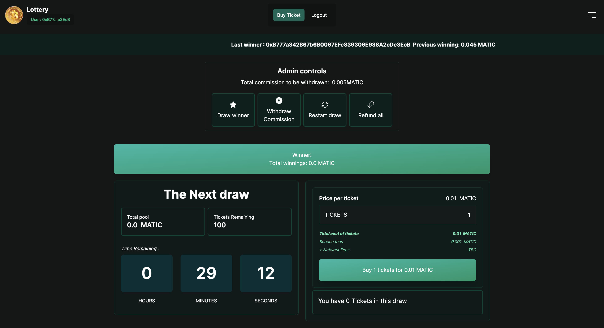

# NEXTJS-SOLIDITY CRYPTO LOTTERY 🪙



This is the WEB3 Crypto Lottery app with nextjs and solidty.

Smart Contract is deployed to [Thirdweb](https://thirdweb.com/) and For this project, we will be using `Matic` currency.

> if you deploy the smart contract, you are by default the admin
> Whenever, a winner is drawn, the admin gets a fee from the tickets. Basically, Admin is making money off this.

## Tech stacks

- 🚀 Nextjs
- 🚀 Solidity
- 🚀 Thirdweb
- 🚀 Tailwindcss

## Available scripts

### Contract Version Release

```bash
cd contracts
```

```bash
npx thirdweb@latest release
```
